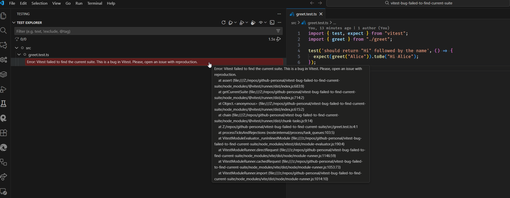

# vitest-bug-failed-to-find-current-suite

- [Intro](#intro)
- [Bug Description](#bug-description)
- [Environment](#environment)
- [Steps to Reproduce](#steps-to-reproduce)
- [Expected Behavior](#expected-behavior)
- [Actual Behavior](#actual-behavior)

## Intro

Minimal reproduction repository for a Vitest bug that occurs when debugging tests using the [Vitest VS Code extension](https://marketplace.visualstudio.com/items?itemName=vitest.explorer).

## Bug Description

When attempting to debug a test using the Vitest VS Code extension, the following error is thrown:

> Error: Vitest failed to find the current suite. This is a bug in Vitest. Please, open an issue with reproduction.

## Environment

- **Vitest**: v4.0.14
- **Vitest VS Code Extension**: v1.34.0
- **Node.js**: v24.11.1
- **Visual Studio Code**
  ```text
  Version: 1.106.3 (user setup)
  Commit: bf9252a2fb45be6893dd8870c0bf37e2e1766d61
  Date: 2025-11-25T22:28:18.024Z
  Electron: 37.7.0
  ElectronBuildId: 12781156
  Chromium: 138.0.7204.251
  Node.js: 22.20.0
  V8: 13.8.258.32-electron.0
  OS: Windows_NT x64 10.0.26200
  ```

## Steps to Reproduce

1. Clone this repository
2. Install dependencies: `npm install`
3. Open the project in VS Code with the Vitest extension installed
4. Try to **debug** the test using the Vitest extension
5. Observe the error in the Vitest extension output

## Expected Behavior

The test should run successfully in debug mode.

## Actual Behavior

The test fails with:

```text
Error: Vitest failed to find the current suite. This is a bug in Vitest. Please, open an issue with reproduction.
    at assert (file:///Z:/repos/github-personal/vitest-bug-failed-to-find-current-suite/node_modules/@vitest/runner/dist/index.js:683:9)
    at getCurrentSuite (file:///Z:/repos/github-personal/vitest-bug-failed-to-find-current-suite/node_modules/@vitest/runner/dist/index.js:714:2)
    ...
```

Full vitest VSCode output log:

```text
[INFO 4:56:17 PM] [v0.0.0] Vitest extension is activated because Vitest is installed or there is a Vite/Vitest config file in the workspace.
[INFO 4:56:17 PM] [API] Resolving configs: vitest-bug-failed-to-find-current-suite/vitest.config.ts
[INFO 4:56:18 PM] [API] Running Vitest v4.0.14 (vitest-bug-failed-to-find-current-suite/vitest.config.ts) with "C:\Program Files\nodejs\node.EXE C:/Users/eduar/.vscode/extensions/vitest.explorer-1.34.0/dist/worker.js"
[INFO 4:56:18 PM] [API] Watching vitest.config.ts
[INFO 4:56:18 PM] [VSCODE] Watching vitest-bug-failed-to-find-current-suite with pattern **/*
[4:56:19 PM] [VSCODE] Ignoring file: .git\config
[4:56:20 PM] [VSCODE] Ignoring file: README.md.git
[INFO 4:56:20 PM] [API] Collecting tests: src/greet.test.ts
[4:56:30 PM] [VSCODE] File changed: src\greet.test.ts
[4:56:30 PM] No test run to finish for
[4:56:30 PM] No files to finish
[4:56:30 PM] [VSCODE] Ignoring file: node_modules\.vite\vitest\da39a3ee5e6b4b0d3255bfef95601890afd80709\results.json
[INFO 4:56:35 PM] [DEBUG] Starting debugging session C:\Program Files\nodejs\node.EXE
[INFO 4:56:35 PM] [DEBUG] Debugging started
[INFO 4:56:35 PM] Running 1 file(s) with name pattern: ^\s?should return "Hi" followed by the name$
[4:56:35 PM] Starting a test run because src/greet.test.ts triggered a watch rerun event
[4:56:35 PM] Enqueuing "should return "Hi" followed by the name"
[INFO 4:56:35 PM] [Worker] Debugger attached.
[Error 4:56:36 PM] Error in Z:/repos/github-personal/vitest-bug-failed-to-find-current-suite/src/greet.test.ts Error: Vitest failed to find the current suite. This is a bug in Vitest. Please, open an issue with reproduction.
    at assert (file:///Z:/repos/github-personal/vitest-bug-failed-to-find-current-suite/node_modules/@vitest/runner/dist/index.js:683:9)
    at getCurrentSuite (file:///Z:/repos/github-personal/vitest-bug-failed-to-find-current-suite/node_modules/@vitest/runner/dist/index.js:714:2)
    at Object.<anonymous> (file:///Z:/repos/github-personal/vitest-bug-failed-to-find-current-suite/node_modules/@vitest/runner/dist/index.js:615:2)
    at chain (file:///Z:/repos/github-personal/vitest-bug-failed-to-find-current-suite/node_modules/@vitest/runner/dist/chunk-tasks.js:9:14)
    at Z:/repos/github-personal/vitest-bug-failed-to-find-current-suite/src/greet.test.ts:4:1
    at processTicksAndRejections (node:internal/process/task_queues:103:5)
    at VitestModuleEvaluator._runInlinedModule (file:///z:/repos/github-personal/vitest-bug-failed-to-find-current-suite/node_modules/vitest/dist/module-evaluator.js:190:4)
    at VitestModuleRunner.directRequest (file:///z:/repos/github-personal/vitest-bug-failed-to-find-current-suite/node_modules/vite/dist/node/module-runner.js:1146:59)
    at VitestModuleRunner.cachedRequest (file:///z:/repos/github-personal/vitest-bug-failed-to-find-current-suite/node_modules/vite/dist/node/module-runner.js:1053:73)
    at VitestModuleRunner.import (file:///z:/repos/github-personal/vitest-bug-failed-to-find-current-suite/node_modules/vite/dist/node/module-runner.js:1014:10)
[4:56:36 PM] Marking "greet.test.ts" as failed with 1 errors
[4:56:36 PM] Marking "greet.test.ts" as failed with 1 errors
[INFO 4:56:36 PM] [Worker] Waiting for the debugger to disconnect...
[4:56:36 PM] Ending test run src/greet.test.ts
[4:56:36 PM] Test run promise is finished, the queue is 0
[4:56:36 PM] [API] Vitest WebSocket connection closed, cannot call RPC anymore.
[4:56:36 PM] Ending test run <none>
[4:56:36 PM] Disposing test runner
[4:56:36 PM] Ending test run <none>
```

Error in VSCode:

